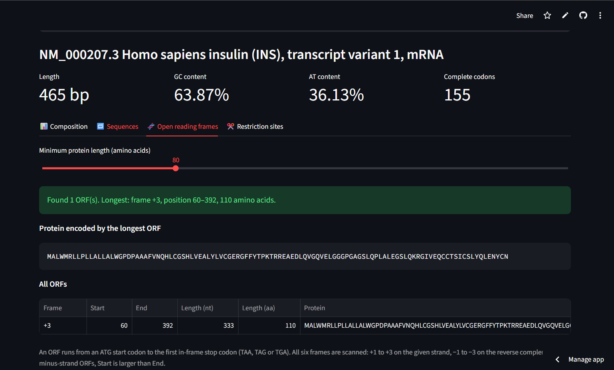

# 🧬 BioSeq Analyzer

A web app for DNA sequence analysis, built with Python and Streamlit. Paste a sequence or upload a FASTA file to get composition statistics, the reverse complement, transcription and translation, open reading frames in all six frames, and a restriction map.

**🔗 Live app:** (https://bioseq-analyzer.streamlit.app/)



## Features

- **Flexible input:** paste plain text or FASTA, or upload a FASTA file (multi-sequence files supported)
- **Composition:** length, GC/AT content, nucleotide counts with an interactive chart
- **Sequence transformations:** reverse complement, mRNA transcript, translation
- **Six-frame ORF finder:** ATG-to-stop ORFs on both strands, with an adjustable minimum length
- **Restriction mapping:** sites for 12 common type II enzymes, an interactive map, and non-cutters for cloning
- **Input validation:** clear errors for non-DNA characters

## Validation

The analysis functions are written from scratch in pure Python; Biopython is used only to check them. A suite of 15 automated tests (pytest) confirms that:

- GC content, reverse complement, transcription and translation match Biopython on 100 random sequences
- The ORF finder matches an independent Biopython-based method across 50 random sequences (600+ ORFs)
- Restriction sites match Biopython's `Bio.Restriction` module (120 sites)

### Case study: human insulin

Tested on the human insulin mRNA (NCBI RefSeq NM_000207.3, 465 bp):

| | BioSeq Analyzer | NCBI annotation |
|---|---|---|
| Coding sequence | 60–392, frame +3 | CDS 60..392 |
| Protein | 110 aa, begins MALWMRLLPLL | Insulin preproprotein (NP_000198.1) |

The ORF finder recovered the annotated coding sequence exactly from the raw mRNA. The restriction map shows that all three PstI sites (CTGCAG) fall in the C-peptide coding region, each encoding a Leu-Gln pair, and that an NcoI site (CCATGG) overlaps the start codon.

## Run it locally

```bash
git clone https://github.com/damilare-kareem/bioseq-analyzer.git
cd bioseq-analyzer
pip install -r requirements.txt
streamlit run app.py
```

Run the tests:

```bash
pip install -r requirements-dev.txt
python -m pytest -v
```

## Project structure

```
app.py                 Streamlit interface
seq_tools.py           Sequence analysis functions (pure Python)
tests/                 pytest suite, validated against Biopython
sample_data/           Example FASTA (human insulin mRNA)
```

## Built with

Python · Streamlit · pandas · Altair · pytest · Biopython (testing only)

## Author

**Kareem Damilare Oreoluwa**, Biochemistry, University of Lagos
[LinkedIn](linkedin.com/in/damilare-kareem0) · [GitHub](https://github.com/damilare-kareem)
